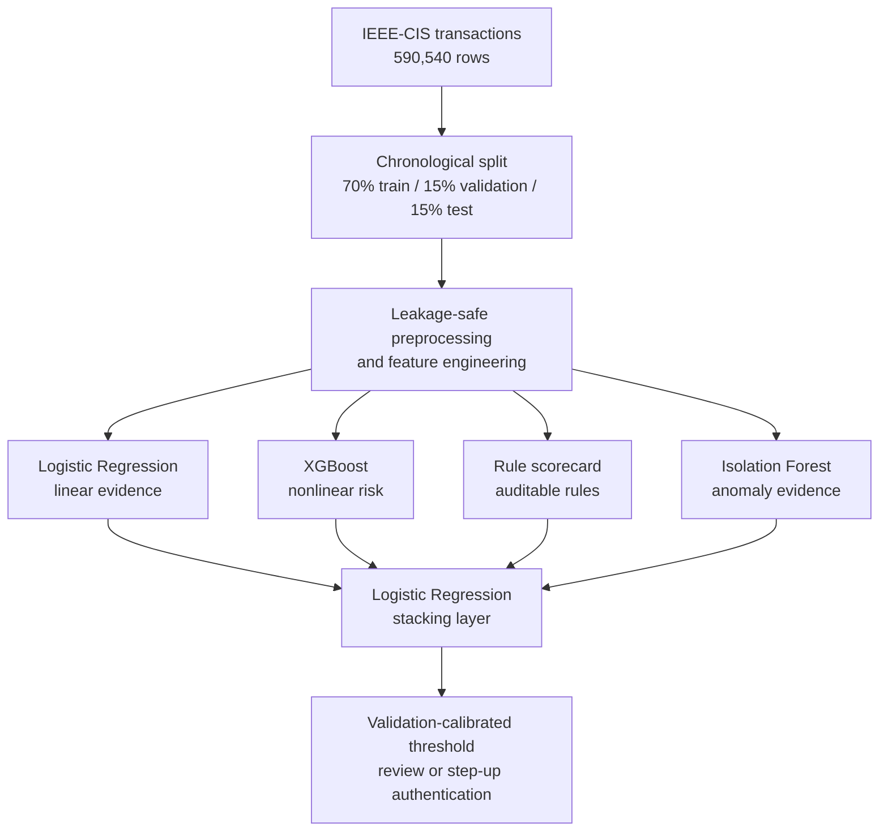

# Multi-Pipeline Fraud Risk Detection

An issuer-side card-not-present (CNP) fraud risk project built on the [IEEE-CIS Fraud Detection](https://www.kaggle.com/c/ieee-fraud-detection) dataset. The system evaluates four specialised analytical pipelines and a stacked decision layer, with the business objective of detecting fraud while limiting false positives and customer friction.

The original project was developed by a four-person team in KNIME/H2O. This repository contains my independent post-submission reconstruction in Python, created to examine the underlying modelling mechanics, reproduce the operating-point results under stricter temporal validation, and test whether the ensemble earns its added complexity.

## Key Result

Using a threshold calibrated on validation data to keep the false-positive rate near 1%, the Python reconstruction achieved **36.39% fraud recall at a 1.04% false-positive rate** on an 88,581-transaction out-of-time test set. This closely reproduced the original KNIME workflow's operating result of **36.45% recall at a 1.04% false-positive rate**.

At this low-friction operating point, the stacked decision layer produced a modest recall increase over standalone XGBoost (36.39% vs. 35.94%). XGBoost nevertheless retained the higher overall PR-AUC (0.426 vs. 0.417), showing that the ensemble's benefit was local to the selected operating region rather than a general improvement across all thresholds.

## Business Question

Can an issuer use card, address, email, match-status and transaction-time evidence to identify a meaningful share of fraudulent transactions while keeping unnecessary customer interventions acceptably low?

The project used fraud recall as the primary detection metric and false-positive rate as a proxy for customer friction. The original minimum success criterion was at least 25% fraud recall with an FPR below 5%; the final system was evaluated at a more conservative operating point of approximately 1% FPR, suitable for targeted step-up authentication or manual review rather than automatic decline.

## System Design



All data-derived preprocessing parameters—including imputations, category mappings, amount quantiles and relationship statistics—are learned from the training period and then applied unchanged to later data. Unknown categories and unseen relationships are handled explicitly rather than recalculated from validation or test observations.

## Why Four Pipelines?

The original architecture was designed around complementary analytical roles rather than four interchangeable classifiers:

- **Logistic Regression** provides a simple linear benchmark and interpretable evidence from transaction and match-related patterns.
- **XGBoost** captures nonlinear interactions and supplies the system's main predictive signal.
- **Rule-based scorecard** converts selected signals into transparent, auditable risk points.
- **Isolation Forest** provides unsupervised anomaly evidence that does not depend on fraud labels.
- **Stacking layer** learns how the four scores should be combined instead of relying on manually assigned weights.

The Python reconstruction also tests this design rather than assuming that an ensemble must outperform its components. The results show that XGBoost carries most of the predictive information, while stacking provides only a small improvement at the low-FPR operating point.

## Validation Design

Transactions are sorted by `TransactionDT` before being divided chronologically:

1. The earliest 70% trains the four base pipelines and all train-fitted transformations.
2. The next 7.5% trains the stacking model using out-of-sample base-model scores.
3. The following 7.5% selects a threshold that maximises recall subject to the specified validation FPR constraint.
4. The latest 15% is used once for out-of-time evaluation.

Every model receives its own threshold selected on the same threshold-validation rows under the same FPR constraint. This allows recall, precision and realised test FPR to be compared at a matched business operating condition.

## Python Reconstruction Results

Dataset and evaluation setup:

- 590,540 transactions with a 3.50% fraud rate
- 413,378 training rows
- 44,290 stacking-model training rows
- 44,291 threshold-selection rows
- 88,581 out-of-time test rows
- 83 encoded model features after preprocessing and feature engineering

### Matched operating-point comparison

Thresholds were independently selected on the same validation subset subject to `FPR <= 1%`, then frozen and applied to the later test period.

| Model | Test recall | Test FPR | Precision | ROC-AUC | PR-AUC |
|---|---:|---:|---:|---:|---:|
| XGBoost | 35.94% | 0.99% | 56.73% | 0.8750 | **0.4255** |
| **Stacked decision layer** | **36.39%** | 1.04% | 55.85% | **0.8770** | 0.4169 |
| Logistic Regression | 23.91% | 2.58% | 25.01% | 0.8111 | 0.2127 |
| Isolation Forest | 4.12% | 2.72% | 5.18% | 0.7176 | 0.0717 |
| Rule-based scorecard | 0.71% | 0.26% | 8.98% | 0.6942 | 0.0626 |

The validation-calibrated ensemble threshold produced 30.02% recall at 0.99% FPR on the threshold-selection period and 36.39% recall at 1.04% FPR on the later test period. The small change in realised FPR illustrates why deployed thresholds require continued monitoring and periodic recalibration.

### Ablation analysis

Leave-one-pipeline-out ablation confirms that XGBoost is the essential component: removing its score reduces ensemble PR-AUC from 0.4169 to 0.1599. Removing the other individual scores slightly improves test PR-AUC in this experiment, suggesting that they add limited or redundant ranking signal. These small differences have not been subjected to confidence-interval testing, so they are treated as diagnostic evidence rather than proof of statistically significant harm.

The deployment decision is therefore not one-sided: standalone XGBoost is simpler and has the stronger overall PR-AUC, while the stacked model achieved a modest observed recall increase in the low-FPR region. The appropriate choice would depend on whether the incremental fraud coverage justifies the additional implementation and monitoring complexity.

## Comparison with the Original KNIME/H2O Workflow

| Metric | Original team workflow | Python reconstruction |
|---|---:|---:|
| Fraud recall | 36.45% | 36.39% |
| False-positive rate | 1.04% | 1.04% |
| Precision | 55.59% | 55.85% |
| ROC-AUC | 0.892 | 0.877 |
| PR-AUC | 0.425 | 0.417 |

The two implementations are not node-for-node equivalents. The Python version uses a stricter chronological train/stack/threshold/test design, revised feature encoding, full-data class weighting, scikit-learn's Isolation Forest and different model hyperparameters. Accordingly, their global ranking metrics are not expected to match exactly. Their near-identical low-FPR operating results are best interpreted as an independent reproduction of the original business trade-off, not an exact software reproduction.

## My Contribution and Project Provenance

For the original team project, I helped define the four-pipeline architecture and the purpose of each component, worked on the shared data-cleaning, missing-value treatment and feature-engineering workflow, implemented the H2O Isolation Forest pipeline, and contributed to the final decision-layer design. I also led the development and delivery of the mid-project and final presentations for a non-specialist audience. Each of the other three specialised pipelines was implemented by a teammate, and the original KNIME workflow and reported team results remain collective work.

The Python implementation in this repository was completed independently after submission. It is a reconstruction of the shared methodology and does not republish teammates' KNIME implementation files.

## Usage

### Requirements

```bash
pip install pandas numpy scikit-learn xgboost
```

Download the IEEE-CIS Fraud Detection data from Kaggle and join the transaction and identity tables while preserving all transaction rows. The raw dataset is not included in this repository because it should be obtained directly from the [competition page](https://www.kaggle.com/c/ieee-fraud-detection).

Run the pipeline at the project's low-friction operating constraint:

```bash
python fraud_pipeline.py --data path/to/ieee_cis_joined_full.csv --max-fpr 0.01
```

`--max-fpr` controls the maximum false-positive rate allowed when selecting each model's operating threshold on the held-out threshold-validation subset. It is a validation constraint rather than a guarantee of the exact FPR realised in a later period.

## Tech Stack

**Python reconstruction:** Python, pandas, NumPy, scikit-learn, XGBoost  
**Original team workflow:** KNIME Analytics Platform, H2O

## Responsible Use and Limitations

- The IEEE-CIS fields are anonymised; masked variables should be interpreted only as empirical signals, not assigned unsupported business meanings.
- Dataset labels and offline metrics do not capture investigation cost, fraud value, chargeback loss or the customer impact of different interventions.
- The output is intended for risk review or step-up authentication, not automatic rejection without further validation and governance.
- Thresholds and feature behaviour may drift over time and should be monitored and recalibrated.
- The observed differences between XGBoost and stacking are small and have not been tested for statistical significance.

## AI Assistance Disclosure

AI tools were used during the Python reconstruction to assist with code drafting, explanatory comments, and debugging. I specified the modelling design and business constraints, executed and reviewed the pipeline, checked the data-splitting and leakage safeguards, and interpreted the reported results. AI-generated suggestions were not treated as evidence without verification against the code outputs and project methodology.
